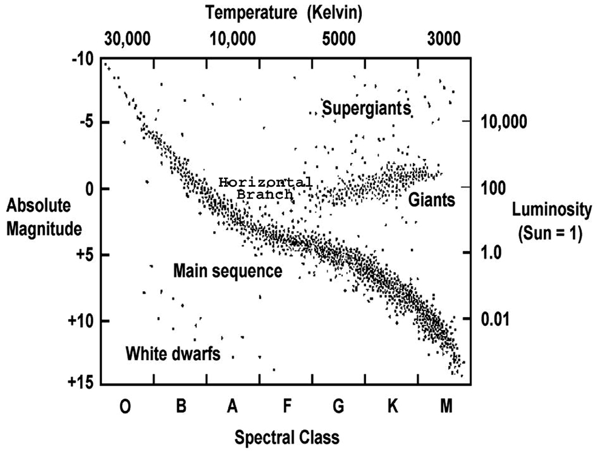
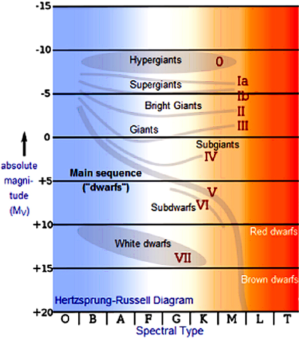

```{r setup, warning=FALSE}
knitr::opts_chunk$set(echo = TRUE)
library(tidyverse)
library(tidymodels)
library(naniar)
library(janitor)
library(ggplot2)
library(dplyr)
library(corrplot)
library(ggh4x)
library(ggthemes)
library(kableExtra)
library(parsnip)
library(e1071)
library(rpart)
```


# Introduction

## Overview

The primary objective of this project is to utilize a range of attributes, both continuous and nominal, to predict the type classification of stars. As described by NASA, stars are "hot balls of hot gas" with distinct life cycles that span from millions to trillions of years. Throughout their lifespan, stars undergo significant changes, and their properties evolve accordingly. Classifying stars based on their attributes is pivotal in understanding their lifecycle stages and behavior. Thus, the analysis of various star attributes constitutes a fundamental aspect of astronomical research and contributes to our broader understanding of these celestial bodies.

Today, two widely accepted stellar classification systems are used: the Harvard System, which is based on a star's surface temperature, and the MK or Yerkes system, which relies on a star's luminosity. The Harvard System categorizes stars from cold to hot surface temperatures in the following order: O, B, A, F, G, K, and M. In the dataset I am working with, this classification is represented by the variable spectral_class. On the other hand, the MK system incorporates both the Harvard System and a luminosity scale that includes designations such as giants, subgiants, main sequence, and others. In the dataset I am working with, this classification is represented by the variable star_type. My primary focus will be on exploring the influence of predictor star attributes on the response varibale star_type, as star_type encompasses various features beyond temperature, and spectral_class is closely related to star_type.

## Data Citation

Baidya, Deepraj. (2020). **Star dataset to predict star types**. Retrieved March 23, 2024 from <https://www.kaggle.com/datasets/deepu1109/star-dataset/data>.

## Project Roadmap

For this project I will first load and tidy the data. Then, I will conduct "Exploratory Data Analysis" and look at the correlation between variables and patterns in the data. At this stage, I will also look into how the dataset corresponds to the famous Hertzsprung-Russel Diagram of stellar classification. After the EDA, I will prepare for model building by dividing the dataset into a training and testing dataset, as well as setting up k-fold cross validation. From this, I will create a general recipe that can be applied to multiple multi-class classification models. Then, I will apply and fit the recipe to four types of models: Gradient Boosted, K Nearest Neighbors, Support Vector Machine, and Decision Tree. I will then compare the average ROC value of the most optimal model of each team and then further explore the top two best models by applying them to the test dataset. Finally, I will look closely into the final chosen model and manually test it using observations from the original dataset to see how predictive it actually is. Let's start!

# Exploratory Data Analysis (EDA)

## Loading and Exploring Raw Data

First, I will load the raw data directly form the csv file. I will use the function clean_names() as it converts all of the variable names to lowercase with underscores, thus making them easier to reference.

```{r}
# loading the data
setwd("~/Documents/Star_Project")
stars_data <- read.csv("star.csv", sep=',')

# renaming predictor columns
stars_data <- clean_names(stars_data)

stars_data %>% 
  head()
```

Next, I will check for missing data using the function gg_miss_var. As we can see, there is no percentage of missing data associated with any of the seven variables in this dataset.

```{r}
# checking for missing data
gg_miss_var(stars_data)
```

## Tidying the Data

Now, I will start to tidy the data. First, I will recode the values in the variable star_type from an arbitrary numerical type to an MK classification type according to the guidelines given on the kaggle site for this dataset. This is an important step as star_type is the response variable we will be focusing on throughout the rest of this project and it should be easily interpretible.

```{r}
# renaming values of the star_type variable
stars_data <- stars_data %>% mutate(star_type = recode(star_type, '0' = 'Brown Dwarf', '1' = 'Red Dwarf', '2' = 'White Dwarf' , '3' = 'Main Sequence', '4' = 'SuperGiant', '5' = 'HyperGiant'))
```

Next, I will factorize the three categorical variables in this dataset: star_type, star_color, and spectral_class. This is so that R does not mistakenly consider these variables as character variables.

```{r}
# factorize categorical variables
stars_data <- stars_data %>%
 mutate(star_type=factor(star_type, levels=c('Brown Dwarf','Red Dwarf','White Dwarf','Main Sequence','SuperGiant','HyperGiant'))) %>%
 mutate(star_color=factor(star_color)) %>%
 mutate(spectral_class=factor(spectral_class, levels=c('O','B','A','F','G','K','M')))

stars_data %>% 
  head()
```

## Describing the Variables

Now that we have cleaned up and tidied the data, we can take a closer look at the variables that we will be working with in this project!

-   Absolute Temperature

    -   type: continuous variable

    -   units of measurement: Kelvin (K)

    -   definition: Measure of the absolute temperature of a star (not relative)

-   Relative Luminosity

    -   type: continuous variable

    -   units of measurement: L/Lo where Lo = 3.828 \* 10\^26 watts (average luminosity of the Sun)

    -   definition: Rate at which a star radiates energy in space

-   Relative Radius

    -   type: continuous variable

    -   units of measurement: R/Ro where Ro =  6.9551 \* 10\^8 meters (average radius of the Sun)

    -   definition: Measures the relative size a star

-   Absolute Magnitude

    -   type: continuous variable

    -   units of measurement: Mv

    -   definition: Measure of how bright a star would appear if it were seen from a standard distance (not relative)

-   Star Type

    -   type: nominal variable

    -   definition: a star's classification according to the MK or Yerkes system of classification

    -   possible values: Brown Dwarf (0), Red Dwarf (1), White Dwarf (2), Main Sequence (3), SuperGiant (4), HyperGiant (5)

-   Star Color

    -   type: nominal variable

    -   definition: a star's apparent "color" that is also a direct measurement of its a star's surface temperature

    -   possible values: White, Red, Blue, Yellow, Yellow-orange, etc.

-   Spectral Class

    -   type: nominal variable

    -   definition: a star's classification according to the Harvard System and is in order of highest to lowest surface temperature

    -   possible values: O, B, A, F, G, K, M

## Visual EDA

Now that we have an idea of what the variables mean and what we will be analyzing, let's conduct a visual exploratory data analysis.

First, I will plot the distribution of the response variable star_type from the dataset:

```{r}
# plotting distribution of star types in the dataset
stars_data %>% 
  ggplot(aes(x = star_type)) +
  geom_bar(color='navyblue', fill='royalblue') + 
  labs(x = "Star Type", y = "# of Stars", title = "Distribution of Star Types")
```

According to the above plot, there is an equal amount of each star type in the data set and therefore a balanced distribution of classes. This may be helpful as it decreases the chance of bias towards any one star type when fitting a model. Thus, the eventual fitted model will likely generalize better on new data.

Now, let's create a correlation matrix using the continuous variables, as you cannot find correlation coefficients associated with nominal variables.

```{r}
# create correlation matrix using full dataset
subset_stars_train <- subset(stars_data, select = -c(5,6,7) )
cor_stars_train <- cor(subset_stars_train)
corrplot(cor_stars_train, method='number')
```

Based on this correlation matrix plot, the strong correlation is a negative correlation between absolute magnitude and luminosity with a correlation coefficient of -0.69. The second strongest relationship is a negative correlation between absolute magnitude and radius with a correlation coefficient of -0.61. While these are not particularly strong, correlations they are still worth exploring visually to gain further insight into the data.

```{r}
ggplot(data = stars_data) + 
  geom_point(mapping = aes(x = absolute_magnitude_mv, y = luminosity_l_lo)) + 
    geom_smooth(mapping = aes(x = absolute_magnitude_mv, y = luminosity_l_lo))
```

As expected, this scatter plot of absolute magnitude and luminosity with a overlapping smooth regression line does not show a particularly notable negative relationship. It is interesting, however, that luminosity appears to drop to zero after an absolute magnitude of zero. This makes sense as the absolute magnitude is a measure of how bright a star appears from a standard distance and luminosity describes this brightness as it is the rate at which a star radiates light into space.

Let's look at this same scatter plot but in the context of star_type, our response variable, in order to see if there is any patterns based on star type.

```{r}
custom_col <- c("#FFDB5D", "#E4961A", "#F96179", "#00BA38", "#4E84C4", "#293352")

ggplot(data = stars_data) + 
  geom_point(mapping = aes(x = absolute_magnitude_mv, y = luminosity_l_lo, color = star_type)) + scale_color_manual(values = custom_col)
```

As we can see, the scatter plot shows a relatively weak negative relationship between the two axis variables, but it shows distinct observation groupings based on the variable star_type.

Let's apply this same scatter plot format for the next strongest relationship based on the correlation matrix: absolute magnitude and radius:

```{r}
ggplot(data = stars_data) + 
  geom_point(mapping = aes(x = absolute_magnitude_mv, y = radius_r_ro, color = star_type)) + scale_color_manual(values = custom_col)
```

Notably, both of the scatter plots show strong groupings of variables based on star_type!

To further verify this phenomenon, let's plot the same scatter plot format for temperature versus absolute magnitude and temperature versus luminosity:

```{r}
ggplot(data = stars_data) + 
  geom_point(mapping = aes(x = temperature_k, y = absolute_magnitude_mv, color = star_type)) + scale_color_manual(values = custom_col)
```

```{r}
ggplot(data = stars_data) + 
  geom_point(mapping = aes(x = temperature_k, y = log(luminosity_l_lo), color = star_type)) + scale_color_manual(values = custom_col)
```

As expected, the groupings based on star type continue with all off the scatter plots of various predictor variables. Now, it's type to see if we can bring all of this together and recreate the famous Hertzsprung-Russel diagram using the observations from the dataset!

According to Britannica.com, the "Hertzsprung-Russell diagram, in astronomy, [is a] graph in which the absolute magnitudes (intrinsic brightness) of stars are plotted against their spectral types (temperatures). Of great importance to theories of stellar evolution, it evolved from charts begun in 1911 by the Danish astronomer Ejnar Hertzsprung and independently by the U.S. astronomer Henry Norris Russell."

[{width="600"}](https://chandra.harvard.edu/edu/formal/variable_stars/bg_info.html)

[{width="550"}](https://chandra.harvard.edu/edu/formal/variable_stars/bg_info.html)

To recreate an H-R diagram with this dataset in R, I am making some modifications. According to its definition, the absolute magnitude of a star is simply a simple way of describing its luminosity so we will be plotting the variable absolute magnitude on the y-axis. The x-axis will be temperature and the variable spectral class will be indicated by the shape of each observational point. Finally, the star_type will be indicated, as with the earlier plots, in the color of each observational point. Additionally, I will emphasize the relative position of the sun by plotting it in the H-R diagram as well.

```{r}
# scatter plot
hr_diagram <-ggplot(data = stars_data) + 
  geom_point(mapping = aes(x = temperature_k, y = absolute_magnitude_mv, color = star_type, shape=spectral_class), size=2, stroke = 2) + 
  scale_y_reverse() + 
  scale_x_reverse() + 
  scale_color_manual(values = custom_col) + 
  scale_shape_manual(values =  c('O','B','A','F','G','K','M')) + 
  labs(title = "Hertzsprung-Russell diagram", x = "Temperature (K)", y ="Absolute Magnitude", color = "Star Type", shape = "Spectral Class") +
  theme(plot.title = element_text(color = "darkorchid4", face = "bold", hjust = 0.5))
hr_diagram_sun <- hr_diagram + geom_point(aes(x = 5778, y = 4.83), size = 3, shape = 21, fill = "gold") + 
  geom_text(aes(x = 5772, y = 4.83, label="Sun"), hjust=1.5, size = 4)

hr_diagram_sun
```

The plot above shows that the dataset does correlate with the Hertzsprung-Russel Diagram!

# Setting Up Models

Now we can start setting up for the models:

## Training/Testing Datasets Split

First, I will split the original dataset into a training set, which will be used to help find the optimal model type, and a testing set, which will be used later to check model accuracy. Using stratified sampling for cross-validation ensures that the samples created are more representative of the original dataset by having similar proportions of the feature of interest which is star_type, in this case.

```{r}
set.seed(74)

stars_split <- initial_split(data = stars_data, prop = 0.70,
                                strata = star_type)
stars_train <- training(stars_split)
stars_test <- testing(stars_split)
```

Now, I will verify the dimensions fo the training and testing data sets to make sure they are indeed split in a 70% proportion.

```{r}
#verifying number of observations in training and testing data sets
dim(stars_train)
dim(stars_test)
```

## Building the Recipe

Now, I will start to build the recipe upon which the four selected multi-class classification models will be built on. I will be omitting the star_color variable from the recipe as it is highly correlated with the variable temperature and including highly correlated variables does not necessarily significantly enhance the predictive quality of models.

```{r}
#dummy code categorical predictor
stars_recipe <- recipe(star_type ~ temperature_k + luminosity_l_lo + radius_r_ro + absolute_magnitude_mv + spectral_class, data = stars_train) %>% 
  step_dummy(all_nominal_predictors())

#centering all predictors
stars_recipe <- stars_recipe %>% 
  step_center(all_predictors())

#scaling all predictors
stars_recipe <- stars_recipe %>% 
  step_scale(all_predictors())

#remove variables containing only a single value (zero variance)
#stars_recipe <- subset(stars_recipe, select = -c(5,6,7) )

#prepping and baking recipe
prep(stars_recipe) %>% 
  bake(new_data = stars_train) %>% 
  head() %>% 
  kable() %>% 
  kable_styling(full_width = F) %>% 
  scroll_box(width = "100%", height = "200px")

```

## K-Fold Cross Validation

Now, I will stratify the training set over the response variable star_type and create five folds to perform stratified cross validation. I only used five folds as this is a relative small training dataset with only 168 observations.

```{r}
#creating 5 folds from the training set
stars_folds <- vfold_cv(stars_train, v = 5, strata = star_type)
stars_folds
```

# Building Prediction Models

Now, we can finally start building the models! To evaluate the performance of the models, I will be looking at the metric roc_auc score which evaluates the performance of binary or, as in this case, multi-level classifiers from a scale of 0 to 1. In an ROC curve graph, the closer the ROC curve is to the upper left corner, the more accurate the predictive model as the true positive rate is higher. In other words, there is more overlap between the true and predicted values of observations in a dataset.


Now that we now we are looking out for high roc_auc values, let's fit the 4 model types of Gradient Boosted, K Nearest Neighbors, Support Vector Machine, and Decision Tree! Here is the basic structure of fitting each of these model types:

1.  creating a model variable based on the specified model type and engine, while establishing the hyperparameters to be tuned for that particular type. The hyperparameters used for each model were:
    1.  Gradient Boosted: tree_depth, min_n
    2.  K Nearest Neighbors: neighbors
    3.  Support Vector Machine: cost, degree
    4.  Decision Tree: tree_depth, min_n
2.  defining the workflow for the model
3.  setting the range for the hyperparameters
4.  fitting the models using the workflow, folds, and hyperparameter grids

Here is an example of this process with the first model type, Gradient Boosted:

```{r, message = FALSE, warning = FALSE, results = FALSE}
# gradient boosted model for classification using "xgboost" engine
gbm_model <- boost_tree(engine = "xgboost", mode = "classification",
                       tree_depth = tune(),
                                     min_n = tune())


# defining the workflow for the gradient boosted model
stars_wflow_gbm <- 
  workflow() %>% 
  add_model(gbm_model) %>% 
  add_recipe(stars_recipe)

# setting the range of hyperparameters
stars_gbm_grid <- grid_regular(
  tree_depth(range = c(3, 12)),
  min_n(range = c(5, 10)),
  levels = 8
)

# fitting the gradient boosted model
stars_gbm_tune <- tune_grid(
  object = stars_wflow_gbm, 
  resamples = stars_folds,   # 5-fold cross-validation
  grid = stars_gbm_grid,
  control = control_grid(verbose = FALSE)
)
```

For each model, type, I think used the functions selected_best() and show_best() to find the specific model throughout all of the folds that was most optimal according to roc_auc score. Here is an example of this step with the model type Gradient Boosted:

```{r, results = FALSE}
# determining the optimal model among the gradient boosted models using select_best() and show_best() functions
stars_select_best_gradient_boosted <- select_best(stars_gbm_tune,
                          metric = "roc_auc",
                          tree_depth, min_n)

stars_select_best_gradient_boosted

stars_show_best_gradient_boosted  <- show_best(stars_gbm_tune, metric = "roc_auc")

stars_show_best_gradient_boosted <- stars_show_best_gradient_boosted[1,]

stars_show_best_gradient_boosted

# storing the chosen gradient boosted model
stars_best_gradient_boosted_final <- stars_show_best_gradient_boosted
```

```{r, include=FALSE}
# k nearest neighbors model for classification using "kknn" engine
stars_neighbors_mod <- nearest_neighbor(neighbors = tune()) %>%
  set_mode("classification") %>%
  set_engine("kknn")

# defining the workflow for the k nearest neighbors model
stars_wflow_neighbors <- 
  workflow() %>% 
  add_model(stars_neighbors_mod) %>% 
  add_recipe(stars_recipe)

# setting the range of hyperparameters
stars_neighbors_grid <- grid_regular(neighbors(range = c(1, 8)), levels = 8)
stars_neighbors_grid

stars_neighbors_grid

# fitting the k nearest neighbors model
stars_neighbors_tune <- tune_grid(
  object = stars_wflow_neighbors , 
  resamples = stars_folds, 
  grid = stars_neighbors_grid,
  control = control_grid(verbose = FALSE)
)
```

```{r}
# determining the optimal model among the k nearest neighbors models using select_best() and show_best() functions
stars_select_best_neighbors <- select_best(stars_neighbors_tune,
                          metric = "roc_auc",
                          neighbors)

stars_select_best_neighbors

stars_show_best_neighbors  <- show_best(stars_neighbors_tune, metric = "roc_auc")

stars_show_best_neighbors <- stars_show_best_neighbors[1,]

stars_show_best_neighbors

# storing the chosen k nearest neighbors model
stars_best_neighbors_final <- stars_show_best_neighbors
```

```{r, include=FALSE}
# svm model for classification using "kernlab" engine
svm_model <- svm_poly(engine = "kernlab", mode = "classification", cost = tune(), degree = tune())

# defining the workflow for the svm model
stars_wflow_svm <- 
  workflow() %>% 
  add_model(svm_model) %>% 
  add_recipe(stars_recipe)

# setting the range of hyperparameters
stars_svm_grid <- grid_regular(
  cost(range = c(0.1, 10)),
  degree(range = c(1, 3)),
  levels = 8
)

# fitting the svm model
stars_svm_tune <- tune_grid(
  object = stars_wflow_svm, 
  resamples = stars_folds, 
  grid = stars_svm_grid,
  control = control_grid(verbose = FALSE)
)
```

```{r}
#determining optimal model among the svm models using select_best() and show_best() functions
stars_select_best_svm <- select_best(stars_svm_tune,
                          metric = "roc_auc",
                          cost, degree)

stars_select_best_svm

stars_show_best_svm  <- show_best(stars_svm_tune, metric = "roc_auc")

stars_show_best_svm <- stars_show_best_svm[1,]

stars_show_best_svm

# storing the chosen svm model
stars_best_svm_final <- stars_show_best_svm
```

```{r, include=FALSE}
# decision tree model for classification using "spart" engine
decision_tree_model <- decision_tree(engine = "rpart", mode = "classification",
                                     tree_depth = tune(),
                                     min_n = tune())

# defining the workflow for the decision trees model
stars_wflow_decision_tree <- 
  workflow() %>% 
  add_model(decision_tree_model) %>% 
  add_recipe(stars_recipe)

# setting the range of hyperparameters
stars_decision_tree_grid <- grid_regular(
  tree_depth(range = c(3, 5)),
  min_n(range = c(5, 10)),
  levels = 8
)

# fitting the decision trees model
stars_decision_tree_tune <- tune_grid(
  object = stars_wflow_decision_tree, 
  resamples = stars_folds, 
  grid = stars_decision_tree_grid,
  control = control_grid(verbose = FALSE)
)
```

```{r}
# determining optimal model among the decision trees models using select_best() and show_best() functions
stars_select_best_decision_tree <- select_best(stars_decision_tree_tune,
                          metric = "roc_auc",
                          tree_depth, min_n)

stars_select_best_decision_tree

stars_show_best_decision_tree  <- show_best(stars_decision_tree_tune, metric = "roc_auc")

stars_show_best_decision_tree <- stars_show_best_decision_tree[1,]

stars_show_best_decision_tree

# storing the chosen decision trees model
stars_best_decision_tree_final <- stars_show_best_decision_tree
```

I did all of these steps with all four of the model types.

# Model Results

After fitting the models, I plotted the fits for each model using the function autoplot():

```{r}
autoplot(stars_gbm_tune)
autoplot(stars_neighbors_tune)
autoplot(stars_svm_tune)
autoplot(stars_decision_tree_tune)
```

The roc_auc and accuracy score metrics are all very high at above 0.9 for all of the model types according to their respective hyperparameters. This means that all fo the models chosen are quite optimal in predicting for this dataset and one will be the "best" only by a small margin.

After and finding the optimal model from each model type, I made a tibble to more easily compare the mean roc_auc scores for the optimal model of each model type:

```{r}
stars_roc_auc_means <- c(stars_best_gradient_boosted_final$mean, stars_best_neighbors_final$mean, stars_best_svm_final$mean, stars_best_decision_tree_final$mean)
stars_mod_names <- c("Gradient Boosted", "K Nearest Neighbors", "Support Vector Machine", "Decision Tree")
stars_results <- tibble(Model = stars_mod_names,
                             ROC_AUC_mean = stars_roc_auc_means)

stars_results <- stars_results %>% 
  dplyr::arrange(-stars_roc_auc_means)

stars_results
```

This shows that the Gradient Boosted and Support Vector Machine models are the most accurate in terms of predictability, although, again, not be a large margin.

# Results from the Best Models

Now, I further explored the top two best models by fitting them to the entire training dataset to get a finalized workflow and fit for each and then augmenting the final model fit to the test data set to see how applicable the predictions are!

## Results: Gradient Boosted Model

```{r}
# fitting selected gradient boosted model to the entire training set
final_stars_gbm_workflow <- finalize_workflow(stars_wflow_gbm, stars_best_gradient_boosted_final)

final_stars_gradient_boosted_fit <- fit(final_stars_gbm_workflow, data = stars_train)
                                               
final_stars_gradient_boosted_fit
```

```{r}
# augment model fit with testing set, predictions for each star type
final_stars_gradient_boosted_test <- augment(final_stars_gradient_boosted_fit, stars_test) %>%
  select(star_type, starts_with(".pred"))

final_stars_gradient_boosted_test
```

I plotted the ROC curves for each level of the outcome variable star_type and they are all very close to the upper left corner, as expected with the very high roc_auc scores.

```{r}
# plotting of the ROC curves, once per level of the outcome variable star_type
roc_curve(final_stars_gradient_boosted_test, truth = star_type, ".pred_Brown Dwarf":".pred_HyperGiant") %>%
  autoplot()
```

I plotted a heat map of the confusion matrix and found that there were no predictive mistakes using the final gradient boosted model! All of the star_type predictions were the same as the actutal star types.

```{r}
# creating heatmap of the confusion matrix of the predictions using the chosen gradient boosted model
conf_mat(final_stars_gradient_boosted_test, truth = star_type, .pred_class) %>% autoplot(type = "heatmap")
```

## Results: Support Vector Machine Model

```{r}
# fitting selected support vector machine model to the entire training set
final_stars_svm_workflow <- finalize_workflow(stars_wflow_svm, stars_best_svm_final)

final_stars_svm_fit <- fit(final_stars_svm_workflow, data = stars_train)
                                               
final_stars_svm_fit
```

```{r}
# augment model fit with testing set, predictions for each star type
final_stars_svm_test <- augment(final_stars_svm_fit, stars_test) %>% select(star_type, starts_with(".pred"))

final_stars_svm_test
```

I did the same ROC curves plots and heat map fo the confusion matrix for the Support Vector Machine Model and found that again, as expected, the chosen SVM model was very accurate and made no mistakes in predicting the test dataset star_type varibale.

```{r}
# plotting of the ROC curves, once per level of the outcome variable star_type
roc_curve(final_stars_svm_test, truth = star_type, ".pred_Brown Dwarf":".pred_HyperGiant") %>%
  autoplot()
```

```{r}
# creating heatmap of the confusion matrix of the predictions using the chosen svm model
conf_mat(final_stars_svm_test, truth = star_type, .pred_class) %>% autoplot(type = "heatmap")
```

# Final Chosen Model

The final chosen model gradient boosted \# 25 had an estimate roc_auc score of 1, which is likely attributed to the small number of observations in the dataset overall and the subsequent potential issue of over fitting.

```{r}
roc_auc(final_stars_gradient_boosted_test, truth = star_type, ".pred_Brown Dwarf":".pred_HyperGiant")
```

## Manually Testing of final chosen model

As some final further tests, I verified manually that test example of stars with various attributes did have the right star_type predictions with the final chosen model. They all worked!

```{r}
# testing prediction of a Brown Dwarf type star
brown_dwarf_test_example <- data.frame(
  temperature_k = 1939,
  luminosity_l_lo = 1.38000e-04,
  radius_r_ro = 0.10300,
  absolute_magnitude_mv = 20.060,
  spectral_class='M'
)

predict(final_stars_gradient_boosted_fit, brown_dwarf_test_example, type = "class")
```

```{r}
# testing prediction of a Brown Dwarf type star
main_sequence_test_example <- data.frame(
  temperature_k = 15276,
  luminosity_l_lo = 1.13600e+03,
  radius_r_ro = 7.20000,
  absolute_magnitude_mv = -1.970,
  spectral_class='B'
)

predict(final_stars_gradient_boosted_fit, main_sequence_test_example, type = "class")
```

```{r}
# testing prediction of a HyperGiant type star
hypergiant_test_example <- data.frame(
  temperature_k = 6850,
  luminosity_l_lo = 2.29000e+05,
  radius_r_ro = 1467.00000,
  absolute_magnitude_mv = -10.070,
  spectral_class='G'
)

predict(final_stars_gradient_boosted_fit, hypergiant_test_example, type = "class")
```

## Conclusion

In conclusion, our analysis indicates that the gradient boosted model has demonstrated the most promising performance in predicting star types within our dataset. With a ROC AUC score of one, the model achieved perfect discrimination between different star types, showcasing its exceptional ability to distinguish between classes. This outstanding performance shows the efficacy of gradient boosting techniques in capturing complex relationships within the data and generating accurate predictions for multiclass classification tasks.
